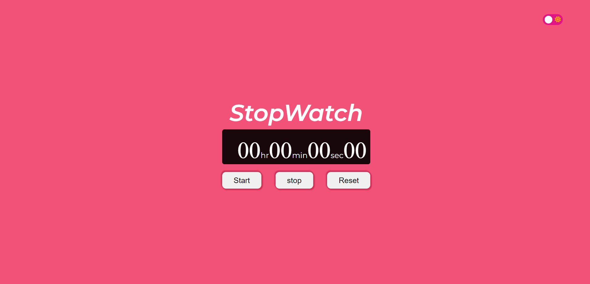

# Calculator App
 ### I have made a Stop Watch by the help of HTML,CSS and JavaScript.

 ### I also add a theme Changer

 

 
 

Live Link:- [Click here!](https://amarjeet-stop-watch-app.netlify.app/)

## Picture of my project:-

.png)

## Technology Used:-
  - ` HTML ` 
  - ` CSS ` 
  - ` JS ` 
## Time Taken For This Project:- 3 hours.
